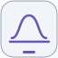

<h1 align="center">Olá 👋🏾, me chamo Wandernilson Valentim!</h1>

<h3 align="center">Análise de Dados • Business Intelligence • Ciência de Dados</h3>

  Transformo dados brutos em análises, visualizações, automações e informações que apoiam a tomada de decisão.

  &nbsp;
  

## 👨🏾‍💻 Sobre mim

Sou graduado em **Gestão Financeira**, curso **Ciência de Dados e Inteligência Artificial** e possuo formação prática em **Análise de Dados pela Generation Brasil**, em um bootcamp de **302,5 horas**. Minha formação financeira contribui para uma visão de negócio aplicada à análise de dados.

Tenho experiência prática em projetos de análise, tratamento e visualização de dados, automação, ETL, modelagem, dashboards e KPIs, utilizando Python, SQL, Power BI e Excel. Conecto a preparação dos dados à análise exploratória e à comunicação de informações úteis para a tomada de decisão.

### Principais competências

- **Preparação e qualidade:** limpeza, padronização de bases, identificação e tratamento de outliers, ETL, pipelines e modelagem de dados.
- **Análise e decisão:** EDA, estatística aplicada, teste de hipóteses, dashboards, KPIs e visualização de dados orientada ao negócio.
- **Entrega e manutenção:** consultas SQL, automação com Python, versionamento e documentação de análises e processos.

## 🚀 Tecnologias e ferramentas

### 📊 Análise e Business Intelligence

  
  
  
  

Power BI • Excel • Power Query • DAX

Dashboards • KPIs • EDA • Visualização de Dados

### 🐍 Linguagens e Bibliotecas

  
  
  
  
  
  

Python • SQL • Pandas • NumPy • Matplotlib • scikit-learn

### 🗄️ Dados

  
  
  
  
  
  

MySQL • ETL • Pipelines de Dados • Modelagem de Dados • Tratamento de Dados • Identificação e Tratamento de Outliers

### 📐 Estatística

  
  
  
  
  
  

Estatística Aplicada • Estatística Descritiva • Média • Mediana • Moda • Teste de Hipóteses

### 🛠️ Ferramentas

  
  
  
  
  
  
  
  

Git • GitHub • GitHub Projects • Jupyter Notebook • Visual Studio Code • Jira • Trello • Miro

### 🔄 Gestão Ágil

  
  
  
  

Scrum • Kanban • Sprints • Backlog

### 🤖 IA Generativa e Produtividade

  
  
  
  
  

ChatGPT • Codex • Claude • Gemini • Microsoft Copilot

Utilizo ferramentas de IA generativa como apoio em análise de dados, programação, documentação, automação e produtividade, com revisão técnica das entregas.

### 📚 Conhecimentos

  
  
  
  

Big Data • Machine Learning • IA aplicada a Dados • Automação de Processos

## 💼 Projetos

### 🎨 Aurena — Análise de Mercado e Inclusividade de Tons

Análise de dados voltada à comparação da diversidade e inclusividade de tons de bases de maquiagem nos mercados nacional e internacional.

**Tecnologias:** Python • SQL • Power BI • DAX • ETL • EDA • KPIs

- Coleta, tratamento e padronização dos dados; análise em Python e estruturação do banco de dados.
- Integração com Power BI, modelagem, medidas DAX, KPIs, dashboards e filtros.
- Análise exploratória, comparação entre mercados, identificação de padrões e apresentação da metodologia e dos insights.

[Ver projeto integrador Aurena](https://github.com/AurenaMake/Avanco-da-industria-da-maquiagem)

### 💳 Contabilidade Pessoal — Automação de Dados Financeiros

Aplicação criada para automatizar o processamento de informações provenientes de faturas de cartão de crédito.

**Tecnologias:** Python • ETL • PDF • Excel • Automação

- Leitura de PDFs e imagens, extração de dados e identificação de compras parceladas.
- Classificação e complementação de informações, tratamento e padronização.
- Exportação para Excel e preparação dos dados para análises e dashboards, reduzindo etapas manuais.

### 📍 Extração de Pontos de Venda OOH

Projeto desenvolvido para automatizar a coleta e organização de pontos de mídia OOH.

**Tecnologias:** Python • Web Scraping • ETL • Google Maps • Geolocalização

- Web scraping e extração automatizada de pontos, com tratamento e organização de endereço, rua e bairro.
- Validação geográfica e integração com Google Maps.
- Automação de relatórios e geração de relatórios executivos em PDF.

Projeto complementar · Análise Exploratória de Vendas de um E-commerce

Projeto desenvolvido no Google Colab com Python, Pandas, NumPy, Matplotlib e Seaborn para preparar, analisar e interpretar uma base de vendas.

As etapas incluem carregamento e validação da base, análise de dimensões e tipos, identificação de ausentes, remoção de duplicados, investigação de outliers, criação de atributos, agrupamentos por região e dia da semana, gráficos, interpretação e recomendações de negócio.

| Indicador | Resultado |
| --- | ---: |
| Total de vendas analisado | R$ 3.250,00 |
| Lucro identificado | R$ 682,24 |
| Dia com maior venda | Terça-feira |
| Venda registrada na terça-feira | R$ 1.000,00 |
| Região com maior faturamento | North |
| Faturamento da região North | R$ 1.350,00 |
| Dias com menores vendas | Quarta-feira e domingo |

> Análise demonstrativa com dez registros; os resultados devem ser interpretados considerando o tamanho reduzido da amostra.

[Ver projeto de e-commerce](https://github.com/wn-dr/analise-exploratoria-vendas)

## 🎓 Formação

### Ciência de Dados e Inteligência Artificial
Faculdade Descomplica · 08/2026 – 12/2028 · Em curso

### Gestão Financeira
IBMR · Conclusão: 08/2022

### Técnico em Manutenção de Computadores
FAETEC · Conclusão: 05/2011

## 📘 Formação prática em Análise de Dados

### Generation Brasil

**Bootcamp em Análise de Dados — 302,5 horas**

Conteúdos da formação e Projeto Integrador

- Fundamentos da Análise de Dados
- Estatística aplicada
- Estatística Descritiva
- Excel para análise de dados
- SQL para análise de dados
- Python para análise de dados
- Teste de Hipóteses
- Visualização e Relatórios de Dados
- Big Data
- Machine Learning
- Inteligência Artificial aplicada a Dados
- Tecnologia generalista de IA
- Projeto Integrador de 46 horas

## 📫 Contato

Estou aberto a conexões profissionais, colaboração em projetos e discussões sobre Análise de Dados, Business Intelligence, Ciência de Dados e automação.

  &nbsp;
  

<i>Dados bem estruturados transformam informação em decisão.</i>

